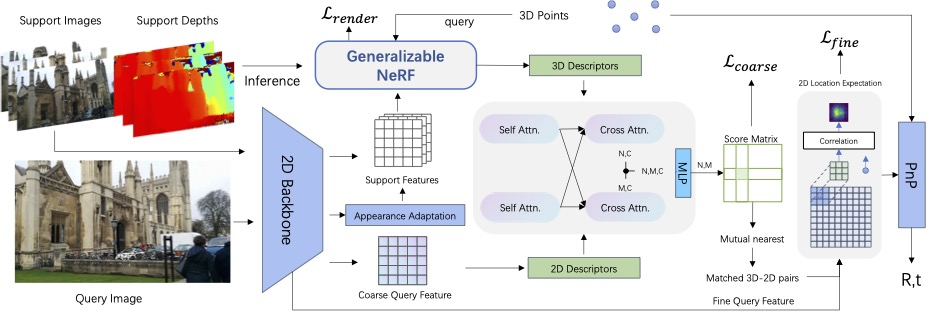

# NeRF-Loc


This project the PyTorch implementation of [NeRF-Loc](https://arxiv.org/abs/2304.07979), a visual-localization pipeline based on conditional NeRF.


## Installation
Environment 
+ python3.8
+ cuda11.3

1. clone with submodules
```
git clone --recursive https://github.com/JenningsL/nerf-loc.git
```
2. install colmap, following the instruction [here](https://colmap.github.io/install.html)
3. install python packages

```
conda create --name nerf-loc python=3.8 -y
conda activate nerf-loc
pip install -r requirements.txt
# install pytorch3d from source
git clone https://github.com/facebookresearch/pytorch3d.git
git checkout v0.6.0
conda install -c bottler nvidiacub
pip install -e .
```

## How To Run?

`cd nerf-loc && export PYTHONPATH=.`
### Data Preparation

1. Download data for [Cambridge](https://github.com/vislearn/dsacstar#cambridge-landmarks), [12scenes](https://github.com/vislearn/dsacstar#12scenes), [7scenes](https://github.com/vislearn/dsacstar#7scenes) and [Onepose](https://github.com/zju3dv/OnePose) following their instructions. Create `data` folder and put the downloaded dataset to `data/Cambridge`, `data/12scenes`, `data/7scenes` and `data/onepose` respectively. You can also change the `base_dir` of datasets by modifying dataset configs in `nerf_loc/configs/data`.
2. Preprocess datasets: 

```
python3 nerf_loc/datasets/video/preprocess_cambridge.py data/Cambridge
python3 datasets/video/preprocess_12scenes.py data/12scenes
python3 datasets/video/preprocess_7scenes.py data/7scenes
```

3. Run image retrieval

```
python3 models/image_retrieval/run.py --config ${CONFIG}
```
replace `{CONFIG}` with `nerf_loc/configs/cambridge_all.txt` | `nerf_loc/configs/12scenes_all.txt` | `nerf_loc/configs/7scenes_all.txt` | etc.

### Training

First, train scene-agnostic NeRF-Loc across different scenes: 

```
python3 pl/train.py --config ${CONFIG} --num_nodes ${HOST_NUM}
```

replace `{CONFIG}` with `nerf_loc/configs/cambridge_all.txt` | `nerf_loc/configs/12scenes_all.txt` | `nerf_loc/configs/7scenes_all.txt` | etc.

Then, finetune on a certain scene to get scene-specific NeRF-Loc model.

```
python3 pl/train.py --config ${CONFIG} --num_nodes ${HOST_NUM}
```
`
replace `{CONFIG}` with `nerf_loc/configs/cambridge/KingsCollege.txt` | `nerf_loc/configs/12scenes/apt1_kitchen.txt` | `nerf_loc/configs/7scenes/chess.txt` | etc.

---

### Evaluation

To evaluate NeRF-Loc: 

```
python3 pl/test.py --config ${CONFIG} --ckpt ${CKPT}
```

replace `{CONFIG}` with `nerf_loc/configs/cambridge/KingsCollege.txt` | `nerf_loc/configs/12scenes/apt1_kitchen.txt` | `nerf_loc/configs/7scenes/chess.txt` | etc.
replace `{CKPT}` with the path of checkpoint file.


### Pre-trained Models
The 2d backbone weights of COTR can be downloaded [here](https://www.cs.ubc.ca/research/kmyi_data/files/2021/cotr/default.zip), please put it in `nerf_loc/models/COTR/default/checkpoint.pth.tar`.
You can download the NeRF-Loc pre-trained models [here](). TODO:

## Acknowledgements
Our codes are largely borrowed from the following works, thanks for their excellent contributions!
+ [Neuray](https://github.com/liuyuan-pal/NeuRay) 
+ [LoFTR](https://github.com/zju3dv/LoFTR) 
+ [COTR](https://github.com/ubc-vision/COTR)
+ [HLoc](https://github.com/cvg/Hierarchical-Localization)
+ [DSM](https://github.com/Tangshitao/Dense-Scene-Matching)
+ [Colmap](https://github.com/colmap/colmap)

## Citation
```
@misc{liu2023nerfloc,
      title={NeRF-Loc: Visual Localization with Conditional Neural Radiance Field}, 
      author={Jianlin Liu and Qiang Nie and Yong Liu and Chengjie Wang},
      year={2023},
      eprint={2304.07979},
      archivePrefix={arXiv},
      primaryClass={cs.CV}
}
```
